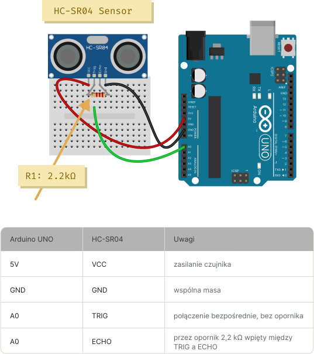

# README



## Setup

```sh
# Use node v18.15.0
nvm use 18.15.0
```

```sh
cp .env.example .env 
npm install node-gyp
npm install
```

Check port and assign it in `BOARD_PORT in` in `.env`

```sh
npx @serialport/list
```

## Troubleshooting

<https://github.com/rwaldron/johnny-five/wiki/Getting-Started#trouble-shooting>
