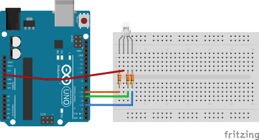

# README

```sh
nvm use 24
npm install
```

.

Compile `./rgb_led/rgb_led.ino`.

Start Express server:

```sh
npm start
```

Go to `http://localhost:3000` and pair your device clicking on **Connect to Device**.
